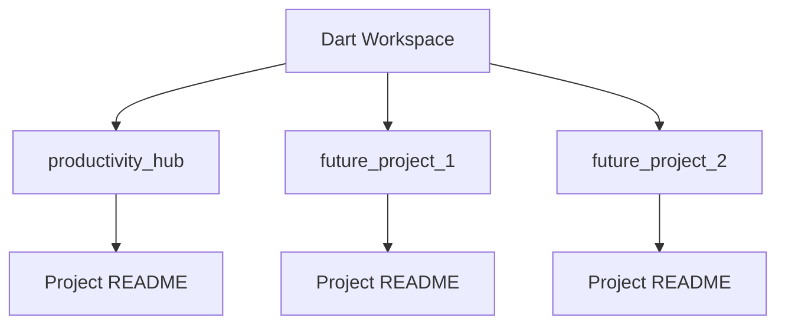

# Dart Workspace

This folder is a personal Dart/Flutter workspace used to host multiple projects.

## Purpose

- Keep all Dart and Flutter apps in one place
- Maintain consistent setup, quality checks, and publishing flow
- Serve as a portfolio-ready workspace for GitHub repositories

## Current Projects

| Project | Type | Status | Description |
|---|---|---|---|
| `productivity_hub` | Flutter app | Active | Productivity app with Tasks + Notes, provider state management, and local persistence |

## Recommended Workspace Layout

```text
Dart/
├── README.md
├── productivity_hub/
├── project_two/
├── project_three/
└── shared_packages/
```

## Reusable Workflow

For each project:

```bash
cd <project_folder>
flutter pub get
flutter analyze
flutter test
flutter run
```

----

## Mermaid Overview



## Quick Start for Adding a New Flutter Project

```bash
cd Dart
flutter create my_new_app
cd my_new_app
flutter pub get
flutter run -d chrome
```

Then add the project entry to this file under **Current Projects**.

---

Keep this workspace README updated as your source of truth for everything in `Dart/`.
