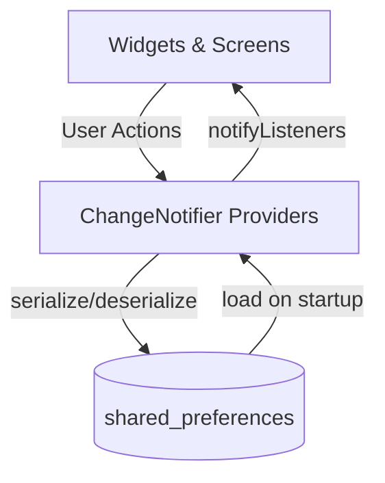
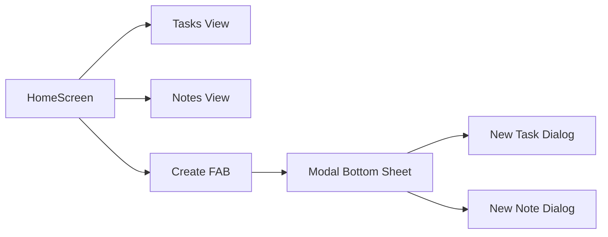

# Productivity Hub

Productivity Hub is a modern Flutter productivity app that combines a task manager and a notes workspace in one clean interface.

## Highlights

- Material 3 UI with an indigo-based color scheme
- Bottom navigation between Tasks and Notes
- Single contextual create flow (Task or Note) from one FAB
- Persistent local storage using `shared_preferences`
- Search, filters, quick stats, and edit flows for better daily usability

## Feature Overview

### Tasks

- Create task with `Low`, `Medium`, or `High` priority
- Mark complete/incomplete with checkbox
- Swipe to delete with undo action
- Edit task title and priority
- Filter by status (`All`, `Active`, `Done`)
- Filter by priority (chip filters)
- Search tasks by title
- Clear all completed tasks
- Live counters for pending and completed tasks

### Notes

- Create notes with title and content
- View notes in a Masonry grid layout
- Search notes by title/content
- Tap note to edit content in a bottom sheet
- Delete note from the editor
- Last-updated timestamp shown on each note card

## Architecture

This project follows a clean folder structure:

- `lib/models`: Data entities (`TodoTask`, `Note`)
- `lib/providers`: State management and persistence logic
- `lib/screens`: Top-level feature screens and app shell
- `lib/widgets`: Reusable UI components

### State & Data Flow



### High-Level App Navigation



## Project Structure

```text
productivity_hub/
├── lib/
│   ├── models/
│   ├── providers/
│   ├── screens/
│   ├── widgets/
│   └── main.dart
├── test/
├── android/
├── ios/
├── web/
├── linux/
├── macos/
├── windows/
├── pubspec.yaml
└── README.md
```

## Getting Started

### Prerequisites

- Flutter `3.41.x` (or compatible stable)
- Dart SDK (bundled with Flutter)
- At least one target device (Chrome, Linux desktop, emulator, or phone)

### Install & Run

From the project root:

```bash
flutter pub get
flutter analyze
flutter test
flutter run -d chrome
```

For Linux desktop:

```bash
flutter run -d linux
```

## Build Commands

```bash
# Web build output in build/web
flutter build web

# Linux desktop build
flutter build linux

# Android (requires Android SDK setup)
flutter build apk
```

## GitHub Push Checklist

1. Ensure app compiles and tests pass:

   ```bash
   flutter analyze && flutter test
   ```

2. Initialize git (if not already initialized):

   ```bash
   git init
   git add .
   git commit -m "Initial commit: Productivity Hub"
   ```

3. Create a GitHub repository and connect remote:

   ```bash
   git remote add origin https://github.com/<your-username>/productivity_hub.git
   git branch -M main
   git push -u origin main
   ```

## Tech Stack

- Flutter
- Provider (`provider`)
- Local persistence (`shared_preferences`)
- Staggered notes layout (`flutter_staggered_grid_view`)

## Current Limitations / Next Roadmap

- No cloud sync yet (local-only storage)
- No reminders or due dates yet
- No authentication yet

Potential next features:

- Due dates and reminder notifications
- Pinned notes and archived tasks
- Export/import local backup
- Theme mode switch (light/dark)

## Contributing (Optional)

If you extend this project:

- Keep architecture aligned with `models/providers/screens/widgets`
- Add/update tests for non-trivial logic
- Run `flutter analyze` and `flutter test` before commits

---

Built with Flutter for a smooth, focused productivity workflow.
